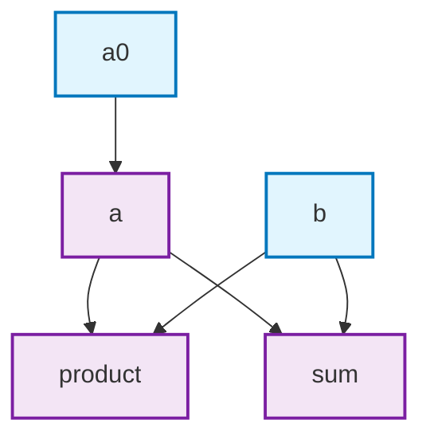
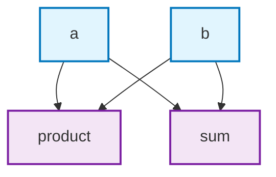

# ReactiveStruct

A macro-based DSL for creating Elixir structs with automatic dependency-based field recomputation. When dependencies change, computed fields are automatically updated in topological order.

## Features

- **Automatic dependency tracking**: Fields recompute only when their dependencies change
- **Topological sorting**: Computations execute in correct order for dependency chains
- **Lazy evaluation**: Only affected fields are recomputed
- **Clean API**: Simple `new/1`, `update/2`, and `put/3` functions
- **Visualization**: Generate Mermaid flowcharts of field dependencies

## Installation

Add `reactive_struct` to your list of dependencies in `mix.exs`:

```elixir
def deps do
  [
    {:reactive_struct, github: "chgeuer/reactive_struct"}
  ]
end
```

## Usage

1. `use ReactiveStruct` in your module (optionally with configuration)
2. Define your struct with `defstruct`
3. Define computed fields with `computed/2` macro
4. Create instances with `new/1` and modify with `update/2`

### Configuration Options

ReactiveStruct supports the following options when using the macro:

- `allow_updating_computed_fields` (default: `false`) - Controls whether computed fields can be directly updated

```elixir
# Default behavior - computed fields cannot be updated directly
use ReactiveStruct

# Allow updating computed fields (breaks dependency graph)
use ReactiveStruct, allow_updating_computed_fields: true
```

## Basic Example

```elixir
defmodule Calculator do
  use ReactiveStruct
  defstruct ~w(a0 a b sum product)a

  computed(:a, fn %{a0: a0} -> a0 + 1 end)
  
  computed(:sum, fn %{a: a, b: b} -> a + b end)
  
  computed :product, fn %{a: a, b: b} ->
    a * b
  end
end

Calculator.new(a0: 2, b: 3)
|> IO.inspect(label: :a)    # %Calculator{a0: 2, a: 3, b: 3, sum: 6, product: 9}
|> Calculator.merge(a0: 5)
|> IO.inspect(label: :b)    # %Calculator{a0: 5, a: 6, b: 3, sum: 9, product: 18}
```

Calling `Kino.Mermaid.new(Calculator.mermaid())` results in this little diagram (in Elixir LiveBook):



## Syntax

```elixir
computed(:field_name, fn %{dep1: dep1, dep2: dep2} ->
  dep1 + dep2
end)
```

## Complex Dependencies

ReactiveStruct handles chains of dependencies automatically:

```elixir
defmodule Chain do
  use ReactiveStruct
  defstruct [:base, :step1, :step2, :final]

  computed :step1, fn %{base: base} -> base * 2 end
  computed :step2, fn %{step1: step1} -> step1 + 10 end
  computed :final, fn %{step2: step2} -> step2 * step2 end
end

chain = Chain.new(base: 3)
chain.final  # 256

updated = Chain.merge(chain, :base, 5)
updated.final  # 400
```

## Field Update Restrictions

By default, ReactiveStruct prevents direct updates to computed fields to maintain dependency graph integrity:

```elixir
defmodule Calculator do
  use ReactiveStruct
  defstruct [:a, :b, :sum]

  computed :sum, fn %{a: a, b: b} -> a + b end
end

calc = Calculator.new(a: 1, b: 2)

# ✓ This works - updating input fields
Calculator.merge(calc, :a, 10)

# ✗ This raises ArgumentError - updating computed field
Calculator.merge(calc, :sum, 100)
```

To allow updating computed fields (which may break dependency consistency):

```elixir
defmodule FlexibleCalculator do
  use ReactiveStruct, allow_updating_computed_fields: true
  defstruct [:a, :b, :sum]

  computed :sum, fn %{a: a, b: b} -> a + b end
end

calc = FlexibleCalculator.new(a: 1, b: 2)

# ✓ This now works - computed field can be updated directly
FlexibleCalculator.merge(calc, :sum, 100)
```

## API Functions

ReactiveStruct generates these functions:

- `new/1` - Create instance with initial values (map or keyword list)
- `merge/2` - Update single field or multiple fields
- `put/3` - Alias for single field update
- `mermaid/0` - Generate dependency visualization

```elixir
# Multiple field updates
multi = MyStruct.merge(struct, %{x: 10, y: 20})
multi = MyStruct.merge(struct, x: 10, y: 20)

# Single field update
single = MyStruct.put(struct, :x, 100)
```

## Visualization

Generate Mermaid flowcharts to visualize field dependencies:

```elixir
defmodule Example do
  use ReactiveStruct
  defstruct [:a, :b, :sum, :product]

  computed :sum, fn %{a: a, b: b} -> a + b end
  computed :product, fn %{a: a, b: b} -> a * b end
end

Example.mermaid()
|> Kino.Mermaid.new()
```

results in 



## Error Handling

ReactiveStruct validates dependencies at compile time and runtime:

- **Circular dependencies**: Compilation error
- **Non-existent fields**: Compilation error
- **Computed field updates**: Runtime ArgumentError (unless explicitly allowed)
- **Runtime exceptions**: Propagated from computation functions
- **Nil dependencies**: Handle in computation logic as needed

## Performance

- **Compilation**: O(n²) for dependency analysis
- **Runtime updates**: O(k) where k = affected computed fields
- **Memory**: Minimal overhead, metadata stored at compile time

## License

This project is licensed under the same terms as Elixir.