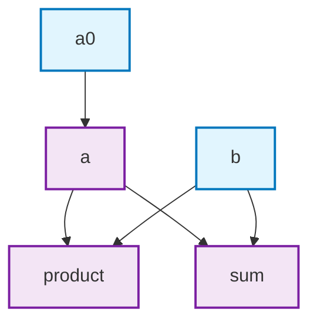
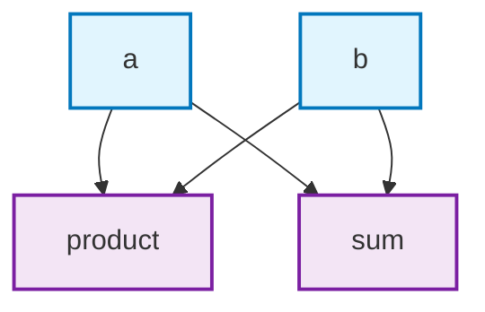

# ReactiveStruct

A macro-based DSL for creating Elixir structs with automatic dependency-based field recomputation. When dependencies change, computed fields are automatically updated in topological order.

## Features

- **Automatic dependency tracking**: Fields recompute only when their dependencies change
- **Topological sorting**: Computations execute in correct order for dependency chains
- **Lazy evaluation**: Only affected fields are recomputed
- **Clean API**: Simple `new/1`, `update/2`, and `put/3` functions
- **Visualization**: Generate Mermaid flowcharts of field dependencies

## Installation

Add `reactive_struct` to your list of dependencies in `mix.exs`:

```elixir
def deps do
  [
    {:reactive_struct, github: "chgeuer/reactive_struct"}
  ]
end
```

## Usage

1. `use ReactiveStruct` in your module
2. Define your struct with `defstruct`
3. Define computed fields with `computed/3` macro
4. Create instances with `new/1` and modify with `update/2`

## Basic Example

```elixir
defmodule Calculator do
  use ReactiveStruct
  defstruct ~w(a0 a b sum product)a

  computed(:a, deps: [:a0], do: a0 + 1)
  
  computed(:sum, deps: [:a, :b], do: a + b)
  
  computed :product, deps: [:a, :b] do
    a * b
  end
end

Calculator.new(a0: 2, b: 3)
|> IO.inspect(label: :a)    # %Calculator{a0: 2, a: 3, b: 3, sum: 6, product: 9}
|> Calculator.update(a0: 5)
|> IO.inspect(label: :b)    # %Calculator{a0: 5, a: 6, b: 3, sum: 9, product: 18}
```



## Syntax

Two syntaxes are supported for defining computed fields:

```elixir
# Block syntax
computed :field_name, deps: [:dep1, :dep2] do
  dep1 + dep2
end

# Inline syntax
computed(:field_name, deps: [:dep1, :dep2], do: dep1 + dep2)
```

## Complex Dependencies

ReactiveStruct handles chains of dependencies automatically:

```elixir
defmodule Chain do
  use ReactiveStruct
  defstruct [:base, :step1, :step2, :final]

  computed(:step1, deps: [:base], do: base * 2)
  computed(:step2, deps: [:step1], do: step1 + 10)
  computed(:final, deps: [:step2], do: step2 * step2)
end

chain = Chain.new(base: 3)
chain.final  # 256

updated = Chain.update(chain, :base, 5)
updated.final  # 400
```

## API Functions

ReactiveStruct generates these functions:

- `new/1` - Create instance with initial values (map or keyword list)
- `update/2` - Update single field or multiple fields
- `put/3` - Alias for single field update
- `mermaid/0` - Generate dependency visualization

```elixir
# Multiple field updates
multi = MyStruct.update(struct, %{x: 10, y: 20})
multi = MyStruct.update(struct, x: 10, y: 20)

# Single field update
single = MyStruct.put(struct, :x, 100)
```

## Visualization

Generate Mermaid flowcharts to visualize field dependencies:

```elixir
defmodule Example do
  use ReactiveStruct
  defstruct [:a, :b, :sum, :product]

  computed(:sum, deps: [:a, :b], do: a + b)
  computed(:product, deps: [:a, :b], do: a * b)
end

Example.mermaid()
|> Kino.Mermaid.new()
```

results in 



## Error Handling

ReactiveStruct validates dependencies at compile time:

- **Circular dependencies**: Compilation error
- **Non-existent fields**: Compilation error
- **Runtime exceptions**: Propagated from computation functions
- **Nil dependencies**: Handle in computation logic as needed

## Performance

- **Compilation**: O(n²) for dependency analysis
- **Runtime updates**: O(k) where k = affected computed fields
- **Memory**: Minimal overhead, metadata stored at compile time

## License

This project is licensed under the same terms as Elixir.